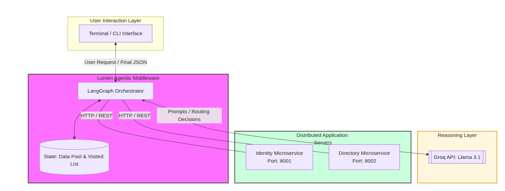
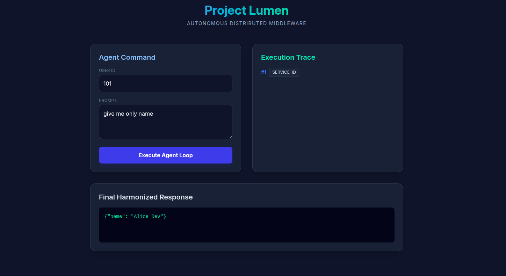
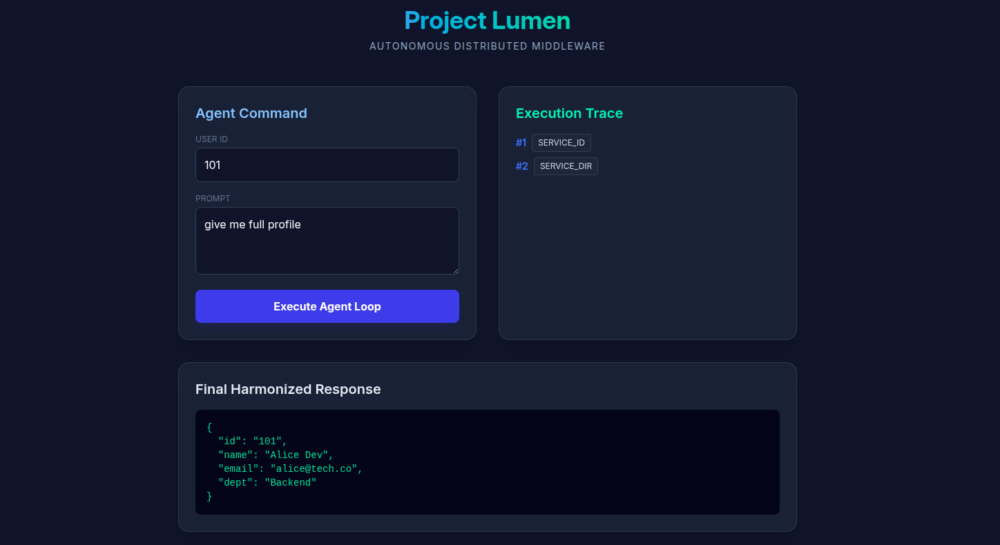

# Project Lumen: Autonomous Distributed Middleware Harmonizer

#### Roll. No : 2023101011, 2023101003
## 1. What is Project Lumen?
Lumen is an **Agentic Middleware Platform** designed to solve the "Data Silo" problem in modern application server architectures. Instead of writing hardcoded scripts to aggregate data from different microservices, Lumen uses an AI Agent to navigate the network, discover data, and harmonize it into a useful format based on natural language intent.

## 2. Why is it "Distributed"?
In a traditional app, logic is centralized. In Lumen, the system is spread across the network:
*   **Decoupled Services:** Data lives in separate microservices (Identity Service and Directory Service) running on different ports (8001, 8002).
*   **Network Boundaries:** The Agent communicates with these services via HTTP/REST, simulating a real-world enterprise environment where servers share nothing but the network.
*   **Orchestration Pattern:** The Agent acts as a centralized brain coordinating decentralized "Workers" (the microservices).

## 3. Why is it "Agentic AI"?
Lumen is not a linear script; it is a **Reasoning Loop**.
*   **Autonomy:** It doesn't follow a fixed path. It looks at the user request and "decides" which server to visit.
*   **State Persistence:** Using **LangGraph**, it maintains a memory (`data_pool`) of what it has found.
*   **Self-Correction:** If it fetches data and realizes it is still missing information (e.g., it has the name but not the email), it autonomously loops back to perform another network fetch.

## 4. How it Works (The Tech Stack)
*   **Orchestration:** LangGraph (StateGraph, Nodes, and Conditional Edges).
*   **LLM "Brain":** Groq API (Llama-3.1-8b-instant) for high-speed reasoning.
*   **Microservices:** FastAPI (Python) running on separate processes.
*   **Networking:** Python `requests` with timeout management.

## 5. Usefulness & Scalability
### The "Semantic" Advantage
Unlike traditional middleware, Lumen is **Schema-Agnostic**:
*   **Adding Columns:** If you add an "Age" column to your Database, you don't need to change the Agent code. The AI (Harmonizer) will automatically see the new data and include it in the response if the user asks for it.
*   **Adding Services:** To add a 3rd or 4th service, you simply "register" the new URL in the Fetcher and add one logic rule in the Investigator. You don't have to write complex "Join" logic; the AI handles the merging of data pool semantically.

## 6. How to Run
1. Create a `.env` file with `GROQ_API_KEY=your_key_here`.
2. Run `pip install -r requirements.txt`
3. **Start Microservices:** `python services.py` (Runs ports 8001 & 8002).
4. Run `python app.py`, then open `http://localhost:8000` in your browser.
5. **Example Request:** User ID: `101`, Request: `Give me a full profile with email`.

---

## 7. Application Idea
**Name:** Lumen

**Problem Statement:** In microservice architectures, data is siloed. Developers waste hours writing "glue code" to aggregate data from different APIs. These aggregators break every time a database schema changes or a new field is added.

**Why an AI Agent?** A standard aggregator is "dumb"—it follows hardcoded paths. An AI Agent can interpret the **intent** of a user request, perform a **gap analysis** on available data, and navigate the distributed network autonomously to "hunt" for the required information.

### 7.1. Agent Definition
**Primary Agent:** The "Lumen Orchestrator"

**Description:** A stateful agent that manages a reasoning loop. It inspects a user request, queries internal distributed services, and formats the result.
*   **Inputs:** `user_id` (The unique identifier) and `user_request` (Natural language intent).
*   **Outputs:** A structured, harmonized JSON object containing data aggregated from multiple distributed sources.

### 7.2. Architecture / Flow
**High-Level Interaction:**
*   **AI Model:** Llama 3.1 (via Groq) acts as the logic engine.
*   **External Tools:** Two FastAPI microservices acting as "Internal Distributed Servers."
*   **State Management:** LangGraph manages the "Short-term memory" (the data collected so far).

**Execution Flow (Step-by-Step):**
1.  **Ingestion:** User provides an ID and a request.
2.  **Investigator Node (Reason):** The Agent checks its `data_pool`. If a name is missing, it targets the **Identity Service**. If contact info is missing, it targets the **Directory Service**.
3.  **Fetcher Node (Act):** The Agent performs an HTTP GET request to the chosen distributed service.
4.  **Loopback:** The Agent returns to the Investigator. If the user request is satisfied, it proceeds; if not, it chooses the next service.
5.  **Harmonizer Node:** The LLM maps the raw, messy data into a clean JSON response.

**Architecture Diagram :**

**DataFlow Diagram :**

### 7.3. Scope
**Hackathon 1 Features:**
*   Distributed microservice architecture (Multiprocessing FastAPI).
*   Autonomous routing (Multi-hop data fetching).
*   Semantic data harmonization (LLM-based output formatting).
*   Loop prevention and error handling for missing users.

**Out of Scope:**
*   Writing data back to services (Read-only for now).
*   User authentication (OAuth/JWT).

### 7.4. Tech Stack
*   **Python 3.10+**
*   **LangGraph** (Orchestration)
*   **Groq / Llama 3.1** (Reasoning Engine)
*   **FastAPI / Uvicorn** (Microservices & Web Gateway)
*   **Tailwind CSS & JavaScript** (Frontend UI)
*   **Requests** (Distributed Communication)

Here is the refined, comprehensive documentation for **Project Lumen**. It integrates the technical utility, practical examples, and the specific requirements for your hackathon submission.

### 7.5. Why is this useful? 
In a real enterprise, schemas change daily. 
*   **The "Zero-Code" Column Change:** If the Identity Service adds a new column `last_login`, you don't need to change the Agent. The AI will see the new data and include it in the "Full Profile" automatically.
*   **Network Resilience:** If a service is down, the Agent doesn't crash. It notes the error in its memory and provides the user with whatever data it *did* find.

### Practical Example of Use
**Scenario:** An HR Manager needs a "Security Badge Summary."
1.  **User Input:** `ID: 101`, `Request: "I need a badge summary with name and department."`
2.  **Agent Step 1:** Investigator realizes it has nothing. Decision: `SERVICE_ID`.
3.  **Agent Step 2:** Fetcher gets `{"id": "101", "name": "Alice Dev"}` from Port 8001.
4.  **Agent Step 3:** Investigator sees the user asked for "department," which is still missing. Decision: `SERVICE_DIR`.
5.  **Agent Step 4:** Fetcher gets `{"dept": "Engineering"}` from Port 8002.
6.  **Agent Step 5:** Harmonizer merges the distributed data into: 
    `{"badge_info": {"name": "Alice Dev", "dept": "Engineering"}}`

### Working Screenshot

### 7.6. Agentic Functionality & Implementation

What distinguishes Lumen from a standard script is its **Autonomous Reasoning Loop**. Below is the technical breakdown of how this functionality is implemented:

#### A. Perception & Gap Analysis (The Investigator)
Unlike a hardcoded "If-Else" aggregator, the agent performs a **Semantic Gap Analysis**. 
*   **How it's implemented:** The `investigator` node receives the current `data_pool` (memory) and the user's natural language `user_request`. 
*   **The Logic:** It compares the "Current State" (what data we have) against the "Goal State" (what the user wants). It identifies missing fields (e.g., "The user wants an email, but the data pool only has a name").

#### B. Stateful Memory (The LangGraph Backbone)
A standard API call is stateless. Lumen is **Stateful**.
*   **How it's implemented:** We utilize a **LangGraph `TypedDict` State**. This acts as the agent's "Short-Term Memory." 
*   **Persistence:** Every time the `fetcher` node retrieves data from a distributed service, it appends that data to the `data_pool`. The `investigator` then re-examines this pool in the next loop iteration, allowing the agent to "remember" what it has already discovered.

#### C. Autonomous Tool Selection (The Control Loop)
The agent decides which "Tool" (Internal Service) to invoke without a predefined sequence.
*   **How it's implemented:** We use **Conditional Edges** in LangGraph. The LLM evaluates the state and returns a specific token (`SERVICE_ID`, `SERVICE_DIR`, or `FINALIZE`). 
*   **The Switchboard:** LangGraph uses this token to physically route the execution to the corresponding Python function (node). This allows for **Non-Linear Execution**—if the name is already in memory, the agent intelligently skips the Identity Service and jumps straight to the Directory Service.

#### D. Semantic Harmonization
Different services return data in different schemas.
*   **How it's implemented:** The `harmonizer` node uses the LLM to perform **Zero-Shot Mapping**. It takes raw JSON from multiple distributed sources and re-maps them into a single, cohesive structure that matches the user's original query intent, effectively acting as an autonomous Data-Translation Layer.

---

### 7.7. Individual Contributions :

#### **Contributor 1 (2023101011): Infrastructure & Distributed Networking**
*   **Microservices Development:** Built and deployed the decoupled **Identity** and **Directory** services using FastAPI.
*   **Web Gateway & UI:** Developed the **FastAPI Web Server** and the **Tailwind CSS Dashboard** to visualize the agent's real-time execution trace.
*   **Network Tooling:** Developed the `fetcher` node logic to handle distributed HTTP requests and connection timeouts.

#### **Contributor 2 (2023101003): AI Orchestration & Logic Architecture**
*   **Agentic Framework:** Designed the **LangGraph** `StateGraph` structure, including state management and cyclical orchestration flow.
*   **Reasoning Logic:** Architected the `investigator` node using **Gap Analysis** for autonomous service selection.
*   **Semantic Harmonization:** Engineered the `harmonizer` prompts to perform zero-shot data mapping across disparate service schemas.

